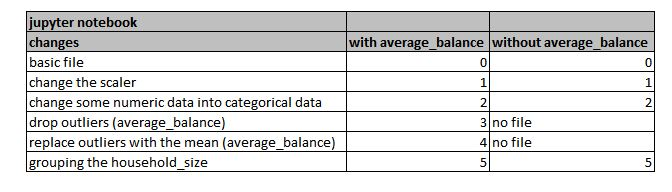

# bellatrix-lestrange
##Worked out by
***
Somin, Jalal anja Anja

## The bank-case
***

## What was happened and what is the aim.
***

In the past, the bank started a marketing offensive. The bank offered his customers new credit-cards. Bute unfortunatley the response was not that what the initiastors expected. The management of the bank decided to start a second markeing campaign to offer this credit card. Becaause the credit-card are an importan business field for the bank. Of course, the bank management want to make sure that this campaignb will be succesfull. Now we need a machine learning model to predict the right Yes to the offer (new credit card).

## The features
***

The follwing features can be use to predict the important yes from the correct customers.

## Our model

We try to improve our model.
We try 5 different changes to achieve a better accuracy.

The results are divided into different jupyter notebooks.

